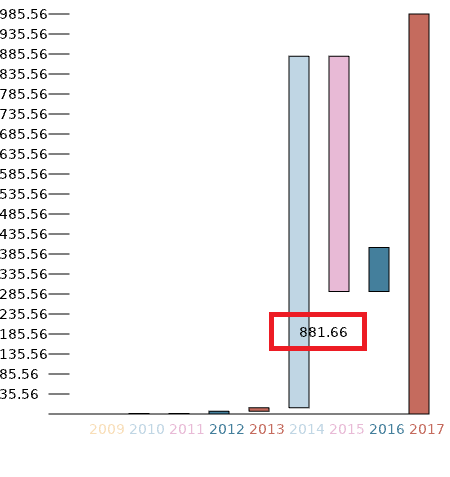
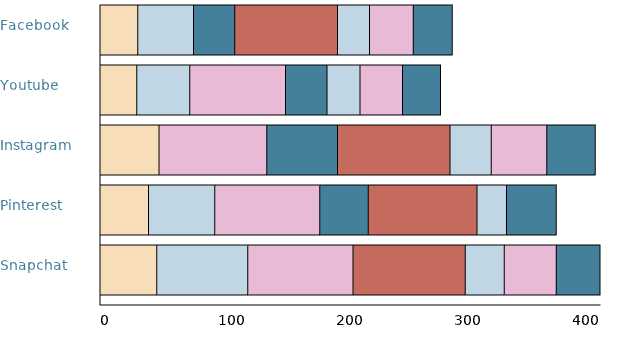
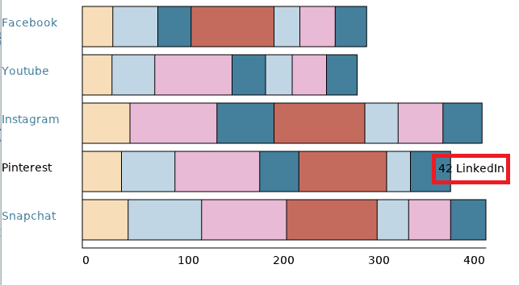

*Base Graphics for Diököl* is a implementation of R Base Graphics library using the Diököl environment.

Examples of base graphics include:

-Waterfall chart: 

*Clicked behavior:

-Bar chart:

*Clicked behavior:

[Examples and Contributions](http://github.com/arce/DklBaseGraphics/wiki)